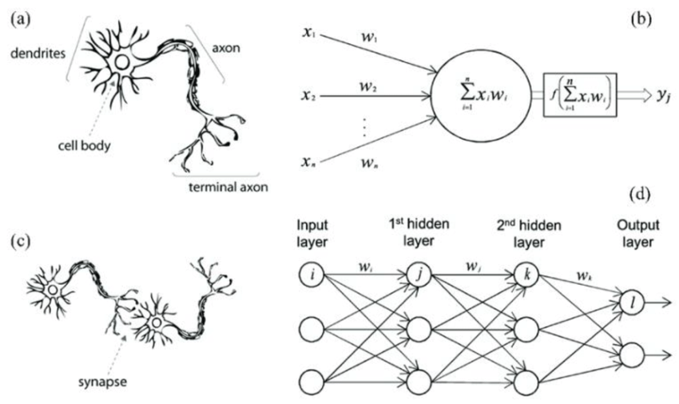

# Neural Networks from Scratch

Source: [A biological neuron in comparison to an artificial neural network.](https://www.researchgate.net/figure/A-biological-neuron-in-comparison-to-an-artificial-neural-network-a-Brain-neuron-b_fig2_351443166)

Originally inspired by [The spelled-out intro to neural networks and backpropagation: building micrograd](https://youtu.be/VMj-3S1tku0?si=ooLtYbzFeESjd3Li) by Andrej Karpathy.